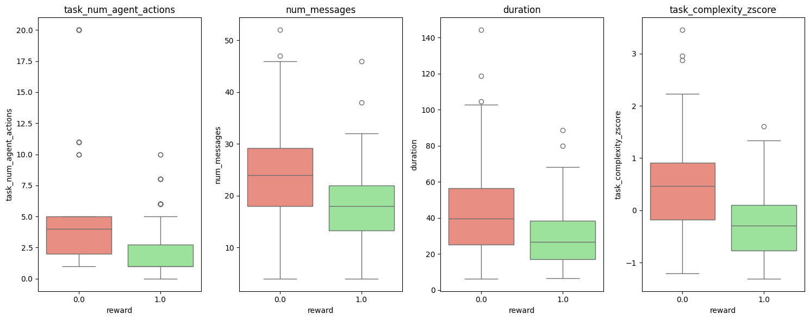

# Introduction

The following is a deep dive analysis of running [tau2-bench](https://github.com/sameerbhadouria/tau2-bench) evaluations on `grok-4-fast-reasoning` model. This is a fork of the [original repo] to incorporate some custom work.

**Purpose:**

The tau2 benchmark evaluates conversational agents in a dual control environment. Previous prior art benchmarks simulated single-control environments where only the AI agent had tools to interact with the world, while the user just provided passive information. The dual control environment simulation provides the user tool calling abilities. This simulates a real world scenario where the user needs to actively participate in modifying the state of the world. In many scenarios the agent may not have access to the entire user state and allowing user tool calling can fill this void during simulation.

## Standard Analysis

tau2-bench has a concept of domain specific tasks and for this exercise, the evaluation was done on the airline domain. The agent is required to follow the Airline Agent Policy defined in the `data/tau2/domains/airline/policy.md` file. There are 50 evaluations tasks `data/tau2/domains/airline/tasks.json` with the following category breakdown:

- Cancellation Policy Testing: ~18 tasks
- Flight Modification Testing: ~22 tasks
- Booking Scenarios: ~5 tasks
- Compensation/Complaints: ~5 tasks
- Membership & Benefits: ~3 tasks
- Insurance-Related: ~4 tasks
- Complex Multi-Transaction: ~3 tasks

(Note: Some tasks overlap multiple categories, so the sum is approximate)

For each domain the standard evaluation returns 3 metrics:

1. Average rewards across all samples
2. pass^k Mean pass^k across all tasks
3. Average agent cost across all samples

This benchmark was run with 4 trials for better statistical reliability (also benchmark submission guideline) and using the temperature of 0.0 - a standard value across benchmarking frameworks to reduce randomness.
The above command will also save the results in the file: `data/simulations/grok_airline_all.json`

Steps to run:

1. Follow the setup instructions in README.md
2. Copy `.env.example` and rename to `.env` and add xai api key `XAI_API_KEY=<api_key>`
3. Under the hood tau2-bench uses LiteLLM which requires prefixing the model with `xai` [Reference](https://docs.litellm.ai/docs/providers/xai)
4. Run the tau2 benchmarks using:

   ```bash
   tau2 run \
   --domain airline \
   --agent-llm xai/grok-4-fast-reasoning \
   --user-llm xai/grok-4-fast-reasoning \
   --num-trials 4 \
   --save-to grok_airline_all

   ```

5. To view details of the tasks and the results run: `tau2 view`

---

Metrics Summary and top 3 leaders comparison:

| Rank |         Model         | Pass^1 | Pass^2 | Pass^3 | Pass^4 | % Drop in Pass k=1 to 4 | Avg Cost |
| ---- | :-------------------: | :----: | :----: | :----: | :----: | :---------------------: | :------: |
| 1    |   Claude-Sonnet-4.5   | 70.0%  |   -    |   -    |   -    |            -            |    -     |
| 2    |   Claude-3.7-Sonnet   | 64.2%  | 58.9%  | 55.4%  | 52.1%  |          18.8%          |          |
| 3    |         GPT-5         | 62.5%  | 55.3%  | 51.0%  | 48.0%  |          23.2%          |  $0.134  |
| 4    | Grok-4-fast-reasoning |  60%   | 53.2%  | 49.2%  | 46.4%  |          22.7%          | $0.0157  |
| 4    |    Claude Sonnet 4    |  60%   |   -    |   -    |   -    |            -            |    -     |

Observations:

1. Decent success rate at average reward of 0.6 ~approx 30/50 tasks. Based on the current tau2-bench [Leaderboard](https://taubench.com/#leaderboard) `grok-4-fast-reasoning` would be rank #4 tied with Claude Sonnet 4 and ahead of Claude Opus 4, Qwen3-Max, o4-mini and o3 models.
2. Very economical to run, at $0.0157 per conversation and 50 tasks it costs only $0.80 cents to run 1 trial. This is more than 11x cheaper compared to Open AI GPT-5.
3. The Pass^k seems to be declining with increase in k. There is a drop of 22.7% or 13.6pp from 0.6 @ k=1 to 0.464 @ k=4. It shows the models don't stay consistent over multiple trials even if we set the temperatue to 0. This also appears to be the case for other models in the leaderboard.

## Deep Dive

The following section is a readout of the analysis done in the `result_analysis/grok_airline_result_analysis.ipynb` notebook.

To understand the failure scenarios better, I used Grok to first classify the various evaluation tasks into categories. Grok was given the policy and task details to categorize the task into one of the following categories:

- Booking Creation
- Flight Modification
- Cancellation Policy
- Compensation/Complaints
- Membership & Benefits
- Insurance Issues
- Complex Multi-Transaction

Further if the task is about user tricking the agent I asked it to append " Tricking" to the categories above.
If the task can't be classified into any of the base categories append " Other" to the categories above.

See `result_analysis/airline_agent_eval_task_classifier.py` for more details.

In the 50 tasks used in our evaluation, we ended up with the following 12 categories and task count

| Category                           | Task Count |
| ---------------------------------- | ---------- |
| Flight Modification                | 11         |
| Cancellation Policy Tricking       | 9          |
| Complex Multi-Transaction          | 8          |
| Flight Modification Tricking       | 6          |
| Compensation/Complaints Tricking   | 4          |
| Booking Creation                   | 3          |
| Complex Multi-Transaction Tricking | 3          |
| Cancellation Policy                | 2          |
| Membership & Benefits              | 1          |
| Insurance Issues Tricking          | 1          |
| Compensation/Complaints            | 1          |
| Insurance Issues                   | 1          |

The following table shows the success rate of the task over 4 trials each consisting of 50 tasks:

| Category                           | Success Count | Total Count | Success Ratio (%) |
| ---------------------------------- | :-----------: | :---------: | :---------------: |
| Cancellation Policy                |       8       |      8      |       100.0       |
| Insurance Issues                   |       4       |      4      |       100.0       |
| Insurance Issues Tricking          |       4       |      4      |       100.0       |
| Membership & Benefits              |       4       |      4      |       100.0       |
| Cancellation Policy Tricking       |      32       |     36      |       88.89       |
| Flight Modification                |      29       |     44      |       65.91       |
| Booking Creation                   |       7       |     12      |       58.33       |
| Flight Modification Tricking       |      14       |     24      |       58.33       |
| Compensation/Complaints Tricking   |       9       |     16      |       56.25       |
| Complex Multi-Transaction          |       8       |     32      |       25.00       |
| Compensation/Complaints            |       0       |      4      |       0.00        |
| Complex Multi-Transaction Tricking |       0       |     12      |       0.00        |

**Observations:**

- Grok achieves a perfect score in Cancellation Policy, Insurance Issues, Insurance Issues Tricking and Membership & Benefits categories.
- On the flip side, it does it really struggles with Complex Multi-Transaction and Compensation/Complaints categories getting almost all of them wrong.

#### Statistical approach

The dependence on success vs task complexity can be proved statistically as well. To do this we can create a measure of task complexity using the num_messages, task_num_agent_actions and duration to create a combined standaridized z-score metric for complexity. We can then compute the p-value with the reward=0 vs reward=1 distributions to identify statistical significance.
For sake of brevity please take a look at the `Task Complexity metrics` section in the `grok_airline_result_analysis.ipynb` notebook.

Using a statistical approach will allow us to scale and automate this process in the future.

### Failure Deep Dives Summary

For brevity only the summary is provided here, see the `Failed Task Deep Dive` section in the `grok_airline_result_analysis.ipynb` notebook.

- Task Category: Complex Multi-Transaction Tricking, Task Id: 23, Trials# 0, 3

  - This is a fairly complex transaction where multiple bookings need to be made with payment efficiently split across them to minimize charges to a Mastercard.
  - User Agent instruction included not to mention previous booking was a Basic Economy but Grok 4 detected as out of policy and recommended
  - User finds a loop hole to split the reservation in to 3 to circumvent the policy of using only 1 certifacte per reservation. This is fine.
  - Grok 4 Agent correctly cancels the previous reservation per policy and is also able to identify that the user trick is per policy and proceeds with the split reservation.
  - Grok identifies that the first names of 2 existing passenger were not the same as the new names requested by the user and it needs this to be corrected.
    - However, in Trial#0, per policy it requested the user for DOB and full names treating them as new passengers instead of updating the first names of the existing passenger profile as requested by the user. The test penalized the Agent reward in this case treating the interaction as a failure.
  - In Trial#3, the user does provide the extra details but the Agent makes a calculation error in computing the correct balance post refund. This results in a payment failure due to not enough balance on the card. The Agent does recognize this error and eventually corrects it but this is not finalized because it was waiting for a confirmation for the updated charge on the card. The user terminates the session.

  - Comments:
    - IMO, trial#0 is an edge case, because the policy states having full information for passengers for a new booking. However, it doesn't explicitly state that profiles of existing passenger from older reservation can be modified.
    - Trial#3, was a mistake and grok identified and corrected it. Unfortunately, it got penalized for early termination by the user.
    - Both these interactions suffer from using a binary reward/scoring system for Agents.

- Task Category: Compensation/Complaints, Task Id: 27, Trials# 1, 3

  - Purpose of this task was to assess that agent correctly issues compensation for delayed flight. This is 2 leg flight with the first leg inprogress and second leg delayed.
  - In Trial#1, the user seems frustrated about delay in the second leg and asks for refund options. The Agent identifies the delayed status of the second leg and offers refund options verifying the user Silver status.
  - Unfortunately, the Agent doesn't check the status of the first leg before offering a full refund + the additional compensation initially.
  - User agrees and Agent only later tries to verify the status of the first leg and realizes the mistake. It clarifies this with the user and transfers to the human agent.
  - In Trial#3, in this case the Agent does correctly identify the flight status and issues the Compensation correctly, but goes too far to make modifications to the flight itinerary by rebooking a flight. This was outside the scope of task expected actions and unfortunately failed the tasks.

  - Comments:
    - Trial#1 was clearly wrong and could frustrate the user more or worse make a grave mistake.
    - Trial#3, could have been an acceptable scenario if the task allowed for this.

- Task Category: Task # 25, trial#0, 1, 2, 3

  - Trial# 3 failed due to privacy concerns because the user asked to create a booking for a friend but didn't know their user id. Friend was saved as a passenger on the users profile.
  - However, Trials#0,1 2 succeeded in creating a new booking for the friend.

  - IMO this part of the policy is subjective and for safety reason Trial# 3 should be considered pass as well.

I would say this a policy issue to define this rule, but agent was more conservative even though the policy didn't state this explicitly

# Critique

Tau2-bench made a great addition to the evaluation framework by enabling conversational agents in a dual control environment. This unlocked a new domain to measure realistic user-agent interactions. The reward has a good breadth using a combination of enviroment, communication, action and database state as a score. However, there are still opportunities to improve the evaluation system. The Pass^k is still a solid metric for consistency.

## Methodology Weakness:

1. I believe the biggest weakness is the Binary Reward Score

   - Although there are many breakdown metrics measuring the Actions, assertions and DB state checks, they only contribute a binary component to the overall reward which is still a binary. This unfortunately is too crude and strict of a measuring and is the biggest weakness of the methodology.
   - As seen in the Failure Deep Dive summary above, in both Task# 23 and 27, the agent gets to the right outcome with some minor deviations and yet was penalized by the binary scoring. We need a better way to create a wider range of score.

2. Secondly, all tasks are treated as equal weighted. A simple task of a single generation has the same weight has a complex multi transaction task.



- As seen in the image above, harder and complex tasks are clearly difficult to pass and should have more weight in the overall score.

## Coverage Gaps

- Missing image input: In many real world scenario, users experience can be significantly improved by asking them to take a screen shot of their itinerary or upload the itinerary as an attachment. This will cover a wider population with different skill levels and demographics to assist them more effectively.
- We further need to account for the user skill and communication diversity, with tasks simulating typos, cross lingual words. Such a task would also need to include some assertions on bias.
- Missing multi-lingual tasks to broaden the scope model benchmarks for other languages.
- Inclusion of Identity Verification tools. If someone gets hold of my reservation number they should not be able to cancel my reservation without verifying they are indeed who they are. Example #3 for Task id# 25 above with the friends booking creation is a good example for this. This may or not be fraudulent, if the card transaction is refunded due to fraud, the liability might fall either on the friend or airline loosing the cost of the ticket.

## Real-World Applicability

- There is a big gap in the tool stability and robustness. We need to enhance task examples that should be tested for tool failure recovery from transient errors as well long delays in recovery. This can simulate real production use cases when a service might return errors or be unresponsive for a long time (like todays AWS outage) leading to degraded service and user experience.
- Further these things need to built into the Agent policy itself to prevent fraudsters from leveraging such situations to coax the agent to deviate from an unclear policy. Example Task # 25, with success trials # 0, 1, 2 to make a new booking for a friend.

## Technical Limitations

- The configurations are configured by CLI mainly making it harder to

# Improvements

Enhancement to the binary score

- LLM grader
- Count based weighted reward

Metrics enhancements:

Added the following new Agent metric enhancements:

1. Based on insights from Anthropic research [3], instead of simply reporting mean eval score, report
   a. Standard Error of the Mean (SEM) and
   b. 95% confidence interval as 1.96 x SEM
2. Success rate (successes/total runs) instead of simple Pass^k
3. Task Complexity Metric - Introduced a concept of task complexity using the expected num_task_actions, real num_messages and real duration. This gives a mix of static task expecation and agent performance on task as an empirical value of task complexity. A mean over all tasks can be considered as a Agent Velocity metric at the model level.
4. Success rate by task complexity quartiles
5. Num agent tool calls.

All of these will be printed for each simulated trial.

Steps to run :

1. LLM Grader based Evaluation

```bash
tau2 evaluate-trajs data/simulations/grok_airline_all.json \
   --evaluation-type llm_grader \
   --llm-grader-model xai/grok-4-fast-reasoning \
   -o data/experiments/domains/airline/llm_grader
```

2. Count weighted based Evaluation

```bash
tau2 evaluate-trajs data/simulations/grok_airline_all.json \
   --evaluation-type weighted_all_with_nl_assertions \
   --llm-grader-model xai/grok-4-fast-reasoning \
   -o data/experiments/domains/airline/weighted_all_with_nl_assertions
```

# Future Enhancements:

- Metrics:
  - Further thinking of the Agent velocity metric as defined in the above enhancements as task complexity.
  - Recommendation#3 from [3] - Reducing variance within questions by decomposing score into 2 terms:
  - The mean score - the average score that the model would achieve if asked the same question an infinite number of times—even if the model might produce a different answer each time; and
  - Random component - the difference between a realized question score and the mean score for that question
  - Recommendation#4 from [3] - Use paired-difference tests to compare models.
- Train before Test detection - There is some material out there that suggests training models on eval data. This could be fine for a localized private task but should be considered cheating for public domain models. This may have impact on both safety and alignment of the model.

## References:

[1] [tau2-bench paper](https://arxiv.org/pdf/2506.07982)

[2] [tau2-bench Leaderboard](https://taubench.com/#leaderboard)

[3] [Statistical Approach to Evals](https://www.anthropic.com/research/statistical-approach-to-model-evals)

[4] [Adding Error Bars to Evals](https://arxiv.org/abs/2411.00640)
